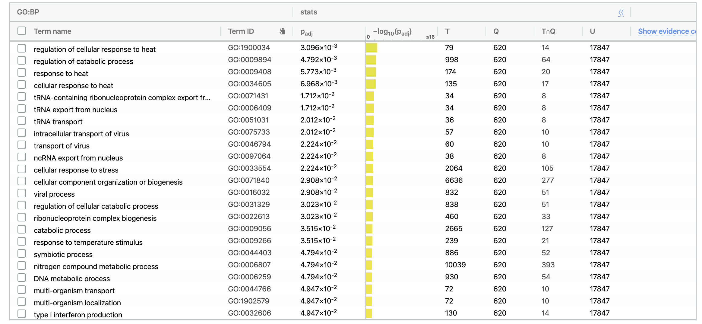
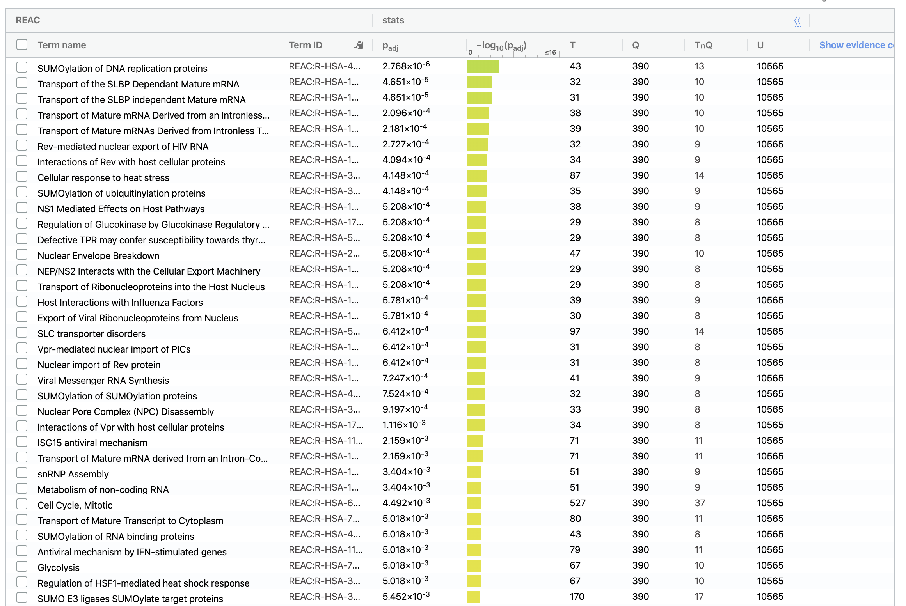
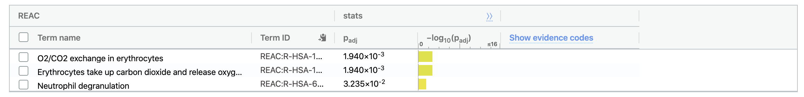
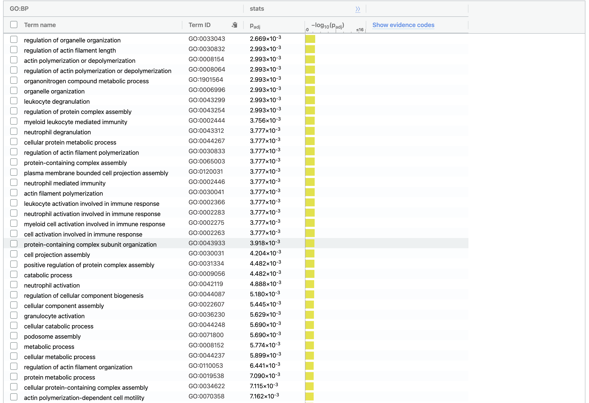
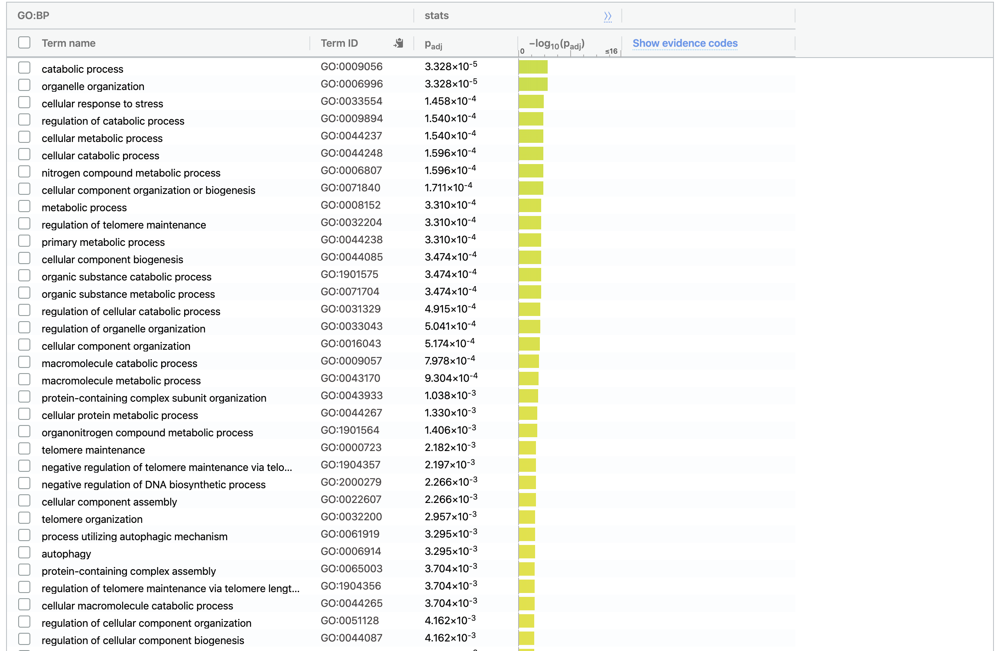
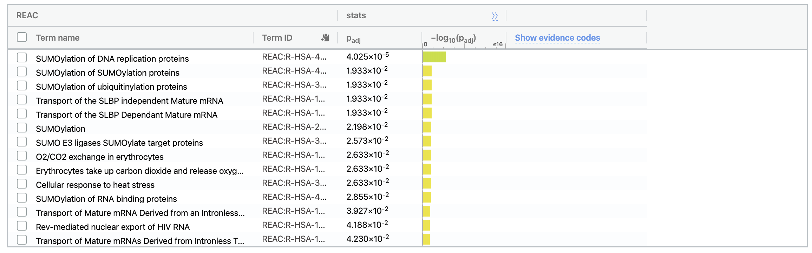

# Dependency Downloads

First, get all depencies and packages necessary to complete all tasks.
```{r warning = FALSE, message = FALSE }
if (!requireNamespace("BiocManager", quietly = TRUE))
    install.packages("BiocManager")
if (!requireNamespace("GEOmetadb", quietly = TRUE))
    BiocManager::install("GEOmetadb")
if (!requireNamespace("kableExtra", quietly = TRUE))
    BiocManager::install("kableExtra")
if (!requireNamespace("gridExtra", quietly = TRUE))
    install.packages("gridExtra")
if (!requireNamespace("org.Hs.eg.db", quietly = TRUE))
    BiocManager::install("org.Hs.eg.db")
if (!requireNamespace("knitr", quietly = TRUE))
    install.packages("knitr")
if (!requireNamespace("biomaRt", quietly = TRUE))
    BiocManager::install("biomaRt")
if (!requireNamespace("edgeR", quietly = TRUE))
    BiocManager::install("edgeR")
if (!requireNamespace("ComplexHeatmap", quietly = TRUE))
    BiocManager::install("ComplexHeatmap")
if (!requireNamespace("circlize", quietly = TRUE))
    BiocManager::install("circlize")
if (!requireNamespace("limma", quietly = TRUE))
    BiocManager::install("limma")
library(edgeR)
library(limma)
library(circlize)
library(ComplexHeatmap)
library(gridExtra)
library(knitr)
library(kableExtra)
library(GEOmetadb)
library(biomaRt)
library(org.Hs.eg.db)
```

# Review of A1

The Expression Dataset I chose was [GSE66306: Impact of bariatric surgery on RNA-seq gene expression profiles of peripheral monocytes in humans](https://www.ncbi.nlm.nih.gov/geo/query/acc.cgi?acc=GSE66306)[@poitou2015bariatric].

## About the Dataset
**Summary**

Genome expression profiles were taken from obese women before, and three months after bariatric surgery.

**Control and Test Conditions**

The conditions that were tested were:

* Before bariatric surgery (T0)

* 3 months after bariatric surgery (T3)

**Why I was Interested**

I have always been interested in health, and maintaining a healthy lifestyle; I was a competitive gymnast until I came to university. I always knew being healthy (whether that means eating healthily or being active / working out) had amazing benefits on your physical, mental, and emotional health. So a study that focused on health, and how a procedure like bariatric surgery can improve someone's physical health, was of high interest to me.


## Clean the Data and Map to HUGO Symbols

**Downloading the Dataset and initial previewing**

 Now that we have looked into information about the dataset, let's download my dataset using BiocManager[@BiocManager] and GEOmetadb[@GEOmetadb]!
```{r results = FALSE, message = FALSE}
sfiles = getGEOSuppFiles('GSE66306')
fnames = rownames(sfiles)
PM_exp = read.delim(fnames[1],header=TRUE,
                       check.names = FALSE, stringsAsFactors = FALSE)
```
Let's first find out the dimensions of my dataset: `r dim(PM_exp)`

This indicates that there are 23354 rows and 40 columns!

Let's take a quick look at what the first few rows and columns of my data looks like:

```{r echo = FALSE}
kable(PM_exp[1:5,1:6], format = "html")
```


A quick summary of what I observed about my dataset:

* There are 23354 genes

* There are gene names, Ensemble gene IDs, and 12 different test cases (two situations per patient, per gene)

* Not all genes have Ensembl gene IDs

* The gene names used are either the [HUGO](https://www.genenames.org/) approved symbol or an alias symbol

**Organize the dataset into patient IDs and cell types**

Before doing further analysis of the dataset, I first want to create a table that lists all patients and easily displays the patient ID as well as the specific cell type analyzed.

```{r echo = FALSE, results = TRUE}
samples <- data.frame(lapply(colnames(PM_exp)[3:40],
                            FUN=function(x){unlist(strsplit(x, split = "_"))[c(1,2)]}))
colnames(samples) <- colnames(PM_exp)[3:40]
rownames(samples) <- c("patients","time")
samples <- data.frame(t(samples))
kable(samples[1:10,], format = "html")
```


**Filter weakly expressed features from my dataset**

Now, back to my dataset. I want to filter out weakly expressed features, using edgeR:
```{r echo = FALSE}
cpms = cpm(PM_exp[,3:40])
rownames(cpms) <- PM_exp[,1]
keep = rowSums(cpms >1) >=3
PM_exp_filtered = PM_exp[keep,]
```
The filtered dimesions of the dataset now are: `r dim(PM_exp_filtered)`.

This means that `r dim(PM_exp)[1] -  dim(PM_exp_filtered)[1]` genes were removed. That means there were `r dim(PM_exp)[1] -  dim(PM_exp_filtered)[1]` outliers.

**Edit the HUGO gene symbols and Ensembl Gene IDs**

As mentioned above, some of the genes are missing Ensembl gene IDs. This is a large issue and I had lots of difficulty trying to salvage as many genes as I could that were missing the Ensembl gene IDs.

First, I tried to separate the genes that were missing ensembl gene IDs from the other genes:
```{r results = FALSE}
na_gene_ids <- PM_exp_filtered[which(is.na(PM_exp_filtered$`Ensembl Gene ID`)), 1]
```
There are `r length(na_gene_ids)` genes without ensembl gene ids!

I also read in the paper that they used hg19 instead of the most recent ensembl. Therefore, after some google searching, I came across [this article](https://m.ensembl.org/info/website/tutorials/grch37.html) that states that hg19 is equivalent to Ensembl's GRCh37. As we were shown how to use Ensembl, I went with GRCh37 for all future queries.

*Method 1: Match the gene names given in dataset to Ensembl IDs*

In my dataset I was given gene ids - some of these were the same as HUGO symbols, while some were aliases or older symbols. I tried to use these to find the associated ensembl gene ids:
```{r message = FALSE}
grch37 = useMart(biomart="ENSEMBL_MART_ENSEMBL", host="grch37.ensembl.org", path="/biomart/martservice") # From https://support.bioconductor.org/p/62064/
ensembl_grch37 = useDataset("hsapiens_gene_ensembl",mart=grch37)
is_na <- getBM(attributes = c("wikigene_name", "ensembl_gene_id"),
               filters = c("wikigene_name"),
               values = na_gene_ids,
               mart = ensembl_grch37)
```
I was fortunate to find `r length(is_na$wikigene_name)` of my ensembl ids. I put them back into the dataset by:
```{r}
for (i in 1:nrow(is_na)) {
  gene_name <- is_na[i,]$wikigene_name
  ensembl_gene_id <- is_na[i,]$ensembl_gene_id
  index <- which(PM_exp_filtered$`Gene Name` == gene_name)
  PM_exp_filtered[index,2] <- ensembl_gene_id
}
still_na <- na_gene_ids[which(!na_gene_ids %in% is_na$wikigene_name)] #remove all now identified gene names
```

Now, I am missing `r length(which(!na_gene_ids %in% is_na$wikigene_name))` ensembl ids.

*Method 2: Use entrez gene ids on genes that begin with LOC*

In my dataset there are quite a few genes that begin with the letters LOC. Dr. Isserlin suggested that if the LOC is removed, these ids can be used as entrez gene ids! I then separated all gene ids that began with LOC and performed a query to use the numbers from the gene ids (that began with LOC) to find matching ensembl gene ids:

```{r}
LOC_indexes <- grep("^LOC", still_na) # Find all gene names beginning with LOC
LOC_names <- still_na[LOC_indexes]
no_LOC_names <- gsub("^LOC", "", LOC_names) # Remove all of the LOC from every gene name beginning with LOC
length(no_LOC_names) #362
LOC_grch37 <- getBM(attributes = c("entrezgene_id", "ensembl_gene_id"),
                    filters = c("entrezgene_id"),
                    values = no_LOC_names,
                    mart = ensembl_grch37)
```

I was able to find `r length(LOC_grch37$entrezgene_id)`. Now I will put them back into my dataset by:
```{r}
for (i in 1:nrow(LOC_grch37)) {
  gene_name <- paste0("LOC", toString(LOC_grch37[i,]$entrezgene_id)) # Add back LOC that they will match with gene names
  ensembl_gene_id <- is_na[i,]$ensembl_gene_id
  index <- which(PM_exp_filtered$`Gene Name` == gene_name)
  PM_exp_filtered[index,2] <- ensembl_gene_id
}
left_LOC_na <- no_LOC_names[which(!no_LOC_names %in% LOC_grch37$entrezgene_id)] # Find all gene names that start with LOC
left_na <- still_na[-LOC_indexes] # Remove all gene names that start with LOC from the <NA> list
```

I am still left with `r length(left_na)` to attempt to find the ensembl gene ids for. I removed all ids that began with LOC from the list of indices I have left to check as that was the only check that would work in finding ensembl gene ids for genes beginning with LOC.

*Method 3: Use list of known aliases to match with dataset gene names*

When I was trying to find a solution to my missing ensembl ids, I came across [this website](https://www.biostars.org/p/14971/) and decided to use this as well! I will try and find proper gene names that map to my dataset's gene names, and use those to find ensembl gene ids.
```{r message = FALSE}
# To get the list of gene names and aliases
dbCon <- org.Hs.eg_dbconn()
sqlQuery <- 'SELECT * FROM alias, gene_info WHERE alias._id == gene_info._id;'
aliasSymbol <- dbGetQuery(dbCon, sqlQuery)

m <- matrix(ncol=2, byrow=TRUE)
colnames(m) <- c('old_symbol', 'new_symbol') # Old symbol is our gene name, new symbol is matching gene name
all_new_symbols <- c()

for (val in left_na) {
  if (val %in% aliasSymbol$alias_symbol) {
    index <- which(aliasSymbol$alias_symbol == val)
    proper_symbol <- aliasSymbol[index,]$symbol[1]
    m <- rbind(m, c(val, proper_symbol)) #to form association b/w the two
    all_new_symbols <- c(all_new_symbols, proper_symbol) #for next step, to match ensembl gene ids with
  }
}

# Get the ensembl gene ids that map to the new gene names
ensembl_w_new_names <- getBM(attributes = c("wikigene_name", "ensembl_gene_id"),
            filters = c("wikigene_name"),
            values = all_new_symbols,
            mart = ensembl_grch37)


# Now, put all of the ensembl gene IDs into the chart
for (i in 1:nrow(ensembl_w_new_names)) {
  gene_name <- ensembl_w_new_names[i,]$wikigene_name # The new name we matched with our gene names
  old_gene_name <- m[which(m[,2] == gene_name)] # Gene names in our dataset
  ensembl_gene_id <- ensembl_w_new_names[i,]$ensembl_gene_id
  index <- which(PM_exp_filtered$`Gene Name` == old_gene_name)
  PM_exp_filtered[index,2] <- ensembl_gene_id
}
```

This is the last method I could find. Even though there are still some genes that are missing ensembl ids, I will leave them in my dataset as they do have some form of identification, though the gene ids used may be aliases or older hugo symbols.

Finally, to actually find the HUGO symbols that map to all of thse ensembl gene ids and add them to the dataset:
```{r message = FALSE}
# Find the HUGO symbols
all_HUGO <- getBM(attributes = c("ensembl_gene_id","hgnc_symbol"),
                   filters = c("ensembl_gene_id"),
                   values = PM_exp_filtered$`Ensembl Gene ID`,
                   mart = ensembl_grch37)
PM_exp_filtered$"HUGO_symbol" <- NA # Add HUGO column to dataset

# Put hugo symbols into the dataset
for (i in 1:nrow(all_HUGO)) {
  ensembl_num <- all_HUGO[i,]$ensembl_gene_id
  hugo_sym <- all_HUGO[i,]$hgnc_symbol
  index <- which(PM_exp_filtered$`Ensembl Gene ID` == ensembl_num)
  PM_exp_filtered$"HUGO_symbol"[index] <- hugo_sym
}
```

Now, it is time to check for duplicates!
```{r}
PM_table <- data.frame(table(PM_exp_filtered$`Ensembl Gene ID`))
all_duplicates <- PM_exp_filtered[PM_exp_filtered$`Ensembl Gene ID` %in% PM_table$Var1[PM_table$Freq > 1],] #check which ensembl ids have a higher frequency than 1, meaning they are duplicated
length(all_duplicates$`Gene Name`) #476
```

I can see that my dataset has 476 duplicates! I want to see which of my genes are duplicates:

```{r}
gene_duplicates <- all_duplicates$`Gene Name`
all_duplicates$`Gene Name`
```
 
 If I remember correctly, the gene names listed here look an awful lot like the list of gene names who origianlly were missing ensemble gene ids! Let's check:
 
```{r}
orig_missing_ensembl <- length(which(gene_duplicates %in% PM_exp$`Gene Name`[is.na(PM_exp$`Ensembl Gene ID`)]))
length(which(gene_duplicates %in% PM_exp$`Gene Name`[is.na(PM_exp$`Ensembl Gene ID`)])) #406

```
 
 Wow! Most of the genes that are duplicates originally had no ensembl gene ids! As these duplicates make up around 3% of my dataset, I am going to leave all of these values in. I don't feel comfortable removing genes, especially when I am unsure of the fact that the genes that are duplicated are being mapped 100% correctly.


## Normalize the Data
Before perfoming any normalization on my dataset, I just wanted to be able to visualize my data.

I chose to use a boxplot because I found it to be the easiest representation to view the data as it showed distributions of each sample's (PM_#) values and lots of information about them in one plot (interquartile range, first and third quartiles, and outliers).

I also used a denstiy plot as it is similar to a histogram, but you are able to easily view the distribution of data over a continuous interval of patient's expression of the genes.

```{r echo = FALSE, warning = FALSE}
data2plot <- log2(cpm(PM_exp_filtered[,3:40]))
boxplot(data2plot, xlab = "Samples", ylab = "log2 CPM",
        las = 2, cex = 0.5, cex.lab = 0.5,
        cex.axis = 0.5, main = "Bariatric Surgery RNASeq Samples")
```

```{r echo = FALSE}
counts_density <- apply(log2(cpm(PM_exp_filtered[,3:40])), 2, density)
xlim <- 0; ylim <- 0
for (i in 1:length(counts_density)) {
  xlim <- range(c(xlim, counts_density[[i]]$x));
  ylim <- range(c(ylim, counts_density[[i]]$y))
}
cols <- rainbow(length(counts_density))
ltys <- rep(1, length(counts_density))
p1 <- plot(counts_density[[1]], xlim=xlim, ylim=ylim, type="n",
     ylab="Smoothing density of log2-CPM", main="", cex.lab = 0.85)
for (i in 1:length(counts_density)) lines(counts_density[[i]], col=cols[i], lty=ltys[i])
legend("topright", colnames(data2plot),
       col=cols, lty=ltys, cex=0.75,
       border ="blue",  text.col = "green4",
       merge = TRUE, bg = "gray90")
```

Now that I have been able to get an overview of what my data looks like, I will normalize the data:

```{r}
filtered_data_matrix <- as.matrix(PM_exp_filtered[,3:40])
rownames(filtered_data_matrix) <- PM_exp_filtered$`Ensembl Gene ID`
d = DGEList(counts=filtered_data_matrix, group=samples$time)
d = calcNormFactors(d)
normalized_counts <- cpm(d)
```

A few of the normalized factors can be displayed:

```{r echo = FALSE, results = TRUE}
kable(d$samples[1:5,], format = "html")
```

We can see that there will be minor modifications to the dataset, but these modifications will still have a slight impact (as seen from the norm.factors column). 

```{r echo = FALSE, message = FALSE, warning = FALSE}
data2plot <- log2(normalized_counts)
boxplot(data2plot, xlab = "Samples", ylab = "log2 CPM",
        las = 2, cex = 0.5, cex.lab = 0.5,
        cex.axis = 0.5, main = "Bariatric Surgery RNASeq Samples")
```


From this plot, I can automatically see that all patients, before and after surgery had very similar interquartile ranges, with a mean around 4. There seemed to be quite a few outliers, many on the more negative side, indicating much lower expression occurred slightly more frequently than very high expression.


```{r echo = FALSE}
counts_density <- apply(log2(normalized_counts), 2, density)
xlim <- 0; ylim <- 0
for (i in 1:length(counts_density)) {
  xlim <- range(c(xlim, counts_density[[i]]$x));
  ylim <- range(c(ylim, counts_density[[i]]$y))
}
cols <- rainbow(length(counts_density))
ltys <- rep(1, length(counts_density))
p2 <- plot(counts_density[[1]], xlim=xlim, ylim=ylim, type="n",
     ylab="Smoothing density of log2-CPM", main="", cex.lab = 0.85)
for (i in 1:length(counts_density)) lines(counts_density[[i]], col=cols[i], lty=ltys[i])
legend("topright", colnames(data2plot),
       col=cols, lty=ltys, cex=0.75,
       border ="blue",  text.col = "green4",
       merge = TRUE, bg = "gray90")
```


The differences between pre-normalization and post-normalization are very minimal, especially in this graph. The different lines indiciating different patients are tigher together, however the mean has not shifted much. It seems that most pateints gene expression hovers around 0.18, with PM02_T3 dipping slightly lower at 0.15.

Now we have caught up with how the dataset was normalized and cleaned, and have a copy of it for further analysis!
```{r}
kable(PM_exp_filtered[1:10,1:10], format = "html")
```


# Differential Gene Expression

Now I will begin analysis of gene expression from my dataset.

## Clustering of Dataset

Before performing any analysis, I will be begin with plotting an MDS graph to analyze the culstering between patients before the surgery and three hours after the surgery.

```{r}
# Make certain modifications to the dataset to remove issues of errors later in the report
#Only incude the genes whose ensembl gene ids are not NULL
PM_exp_filtered <- PM_exp_filtered[-which(is.na(PM_exp_filtered$`Ensembl Gene ID`)),]
#Get rid of all duplicates as well
PM_exp_filtered <- PM_exp_filtered[-which(PM_exp_filtered$`Gene Name` %in% all_duplicates$`Gene Name`),]

heatmap_matrix <- PM_exp_filtered[,4:ncol(PM_exp_filtered)-1]
rownames(heatmap_matrix) <- PM_exp_filtered$`Ensembl Gene ID`
colnames(heatmap_matrix) <- colnames(PM_exp_filtered[,4:ncol(PM_exp_filtered)-1])

plotMDS(heatmap_matrix, col = rep(c("darkgreen","blue"),10))
```

As shown in the graph, there is no two clusterings of patients before (T0) surgery and after (T3) surgery. It seems that most patients cluster just after 0 on the x-axis, for both results of before or after surgery. This indicates that my dataset is not the most ideal dataset, as in an ideal dataset the two treatment cases (T0 and T3) are in two very separate clusters. This may just add noise to my results later on in this process.

To have a further look at my dataset, I will plot an MDS graph and analyze the clustering between each individual patient before and after surgery.

```{r}
pat_colors <- rainbow(10)
pat_colors <- unlist(lapply(pat_colors,FUN=function(x){rep(x,2)}))
plotMDS(heatmap_matrix, col = pat_colors )
```

As shown in the graph, there is a slight clustering within patients before (T0) and after surgery (T3). This is not ideal within a dataset, since patients should not cluster around eachother in the treatment and control cases (T0 and T3). Again, this indicates that noise will be present and may be an issue later on in the gene expression analysis.

Now, I will begin gene expression analysis of my dataset.

## Analysis Using Limma

First, I will create a linear model using Limma[@limma].

```{r}
model_design <- model.matrix(~ samples$time)
kable(model_design, type="html")
```

Next, I will fit my dataset to the linear model by applying empirical Bayes, which uses my data to specify the baseline, or set a prior observation. Then, I will create a table in which the p-values and adjusted p-values for gene expression are calculated.

```{r warning = FALSE}
expressionMatrix <- as.matrix(PM_exp_filtered[,3:40])
rownames(expressionMatrix) <- PM_exp_filtered$`Ensembl Gene ID`
colnames(expressionMatrix) <- colnames(PM_exp_filtered)[3:40]
minimalSet <- ExpressionSet(assayData=expressionMatrix)
fit <- lmFit(minimalSet, model_design)

fit2 <- eBayes(fit,trend=TRUE)
topfit <- topTable(fit2, 
                   coef=ncol(model_design),
                   adjust.method = "BH",
                   number = nrow(expressionMatrix))
#merge hgnc names to topfit table
output_hits <- merge(PM_exp_filtered[,c(2,41)],
                     topfit,
                     by.y=0,by.x=1,
                     all.y=TRUE)
#sort by pvalue
output_hits <- output_hits[order(output_hits$P.Value),]

#view hits
kable(output_hits[1:10,],type="html")
```

Next, I want to see how many of my genes had significant enough expression before, and after adjustment.

```{r}
#How many gene pass the threshold p-value < 0.05?
length(which(output_hits$P.Value < 0.05))

#How many genes pass correction?
length(which(output_hits$adj.P.Val < 0.05))
```

It seems that there are 223 genes that are significant before adjustment, but none after. This indicates that futher processing must be completed to get p-values that have been adjusted that are still significant.

**Multiple Hypothesis Testing**

A method that can be used to improve the results of the adjusted p-values is multiple hypothesis testing! This helps to control for patient variability, by taking both the patients' gene expression AND the number of patients into account, instead of just the patients' gene expression.

First, the linear model needs to be updated so that it now takes into consideration the patients' gene expression and the number of patients.

```{r warning = FALSE, message = FALSE}
model_design_pat <- model.matrix(~ samples$patients + samples$time)
model_design_pat[1:10,1:5]
```

Then, we again fit the model using empirical Bayes.

```{r}
fit_pat <- lmFit(minimalSet, model_design_pat)
fit2_pat <- eBayes(fit_pat,trend=TRUE)
topfit_pat <- topTable(fit2_pat, 
                   coef=ncol(model_design_pat),
                   adjust.method = "BH",
                   number = nrow(expressionMatrix))
#merge hgnc names to topfit table
output_hits_pat <- merge(PM_exp_filtered[,c(2,41)],
                         topfit_pat,by.y=0,by.x=1,all.y=TRUE)
#sort by pvalue
output_hits_pat <- output_hits_pat[order(output_hits_pat$P.Value),]
kable(output_hits_pat[1:10,],type="html")
```

Next, we look at the p-values again like we did previously.

```{r}

#How many gene pass the threshold p-value < 0.05?
length(which(output_hits_pat$P.Value < 0.05))

#How many genes pass correction?
length(which(output_hits_pat$adj.P.Val < 0.05))
```

Unfortunately, the results are again slightly disappointing in that there are still no genes with adjusted p-values that have significant gene expression.

## Analysis Using EdgeR

When I was using Limma, I could not get any significantly differentially expressed genes, before or after multiple hypothesis testing. 

I then re-read my paper and noticed that they also performed gene differential analysis, but used a different package than Limma, as the data seemed to follow a negative binomal distribution. Though Limma works well on data that follows a linear distribution, it should not be used by my data as my data follows a negative binomial distribution instead. EdgeR[@edgeR] is another package that can be used for differential expression, and is great for data that follows a negative binomial distribution - just like mine!

I will confirm that my data follows a negative binomial distribution by plotting the mean-variance graph of my data:

```{r}
filtered_data_matrix <- as.matrix(PM_exp_filtered[,3:40])
rownames(filtered_data_matrix) <- PM_exp_filtered$`Ensembl Gene ID`
d = DGEList(counts=filtered_data_matrix, group=samples$time)
d <- estimateDisp(d, model_design_pat)
plotMeanVar(d, show.raw.vars = TRUE, show.tagwise.vars=TRUE,
            show.ave.raw.vars = TRUE,
            NBline=TRUE,
            show.binned.common.disp.vars = TRUE)
```

The blue line in the above graph is the negative binomial line. As you can see by the red X's, my data follows the negative binomial distribution. Therefore, I can use the edgeR package on my dataset!

First, I will use the edgeR glmQLFTest to fit my dataset. I will fit my dataset using the multiple hypothesis test like I did with Limma, where I used both the number of patients and the pateints' gene expression in an attempt to control for the patients' variability.

```{r}
#model_design_pat already is set to use both the number of patients and the patients' data
fit <- glmQLFit(d, model_design_pat) 
qlf.pos_vs_neg <- glmQLFTest(fit, coef='samples$timeT3')
kable(topTags(qlf.pos_vs_neg), type="html")
```


Next, I will check to see if there are any genes with significant gene expression using this new model.

```{r}
qlf_output_hits <- topTags(qlf.pos_vs_neg,sort.by = "PValue", n = nrow(PM_exp_filtered))
length(which(qlf_output_hits$table$PValue < 0.05))
length(which(qlf_output_hits$table$FDR < 0.05)) #FDR is adjusted p-values
```

Fortunately, there are 138 genes with significant gene expression, even after adjustment!

Next, I will plot the data on a heatmap[@heatmap], and look at the differences between patients before surgery (T0) and after surgery (T3).

```{r}
top_hits <- rownames(qlf_output_hits$table)[qlf_output_hits$table$FDR<0.05] 
heatmap_matrix_tophits <- t(
  scale(t(heatmap_matrix[which(rownames(heatmap_matrix) %in% top_hits),]))) 
heatmap_matrix_tophits<- heatmap_matrix_tophits[,
       c(grep(colnames(heatmap_matrix_tophits),pattern = "T0"),                            grep(colnames(heatmap_matrix_tophits),pattern = "T3"))]
if(min(heatmap_matrix_tophits) == 0){
    heatmap_col = colorRamp2(c( 0, max(heatmap_matrix_tophits)), 
                             c( "white", "red"))
  } else {
    heatmap_col = colorRamp2(c(min(heatmap_matrix_tophits), 0, max(heatmap_matrix_tophits)), c("blue", "white", "red"))
  }
current_heatmap <- Heatmap(as.matrix(heatmap_matrix_tophits),
                           cluster_rows = TRUE,
                           cluster_columns = FALSE,
                               show_row_dend = TRUE,
                               show_column_dend = FALSE,
                               col=heatmap_col,
                               show_column_names = TRUE, 
                               show_row_names = FALSE,
                               show_heatmap_legend = TRUE,
                               )
current_heatmap
```

The heatmap indicates that there is no or very little clustering by conditions. The expression levels vary in both conditions to a large degree, though there seems to be slightly less gene expression before surgery (T0), indicated by a purple colour and there is slightly more gene expression after surgery (T3), indicated by a red colour.

## Genes of Interest

Finally, I will use an MA plot to look at genes of interest in my dataset:

First, I will use a volcano plot to plot the upregulated genes; they can be seen as the orange circles on the graph.

```{r}
plotVolcano <- cbind(qlf_output_hits$table$logFC, -log10(qlf_output_hits$table$FDR))
colnames(plotVolcano) <- c("logFC", "P-val")
upregulated <- qlf_output_hits$table$FDR < 0.05 & qlf_output_hits$table$logFC > 1
downregulated <- qlf_output_hits$table$FDR < 0.05 & qlf_output_hits$table$logFC < 0
point.col <- ifelse(upregulated, "orange", "black")
plot(plotVolcano, col = point.col)
```

Next, I will use a volcano plot to plot the downregulated genes; they can be seen as green circles on the graph.

```{r}
point.col <- ifelse(downregulated, "green", "black")
plot(plotVolcano, col = point.col)
```


# Thresholding

## Finding Upregulated and Downregulated Genes

I am going to continue to use edgeR as it allowed me to find genes that passed correction. With edgeR, I will be finding the downregulated and upregulated genes from my dataset.

```{r}
d <- calcNormFactors(d)
fit <- glmQLFit(d, model_design_pat)
qlf.pos_vs_neg <- glmQLFTest(fit, coef='samples$timeT3')
qlf_output_hits <- topTags(qlf.pos_vs_neg,sort.by = "PValue",
                           n = nrow(filtered_data_matrix))

length(which(qlf_output_hits$table$PValue < 0.05 & qlf_output_hits$table$logFC > 0))
length(which(qlf_output_hits$table$PValue < 0.05 & qlf_output_hits$table$logFC < 0))
```

I was able to find that there are 732 upregulated genes, and 709 downregulated genes! Now I will find the ensembl gene IDs of these genes and save them in text files, which I will put into the g:profiler[@gprofiler] webpage so that I can see what datasets match those genes best.

```{r}
qlf_output_hits_withgn <- merge(PM_exp_filtered[,1:2],qlf_output_hits, by.x=2, by.y = 0)
qlf_output_hits_withgn[,"rank"] <- -log(qlf_output_hits_withgn$PValue,base =10) * sign(qlf_output_hits_withgn$logFC)
qlf_output_hits_withgn <- qlf_output_hits_withgn[order(qlf_output_hits_withgn$rank),]

#Get all of the gene sets
upregulated_genes <- qlf_output_hits_withgn$`Ensembl Gene ID`[which(qlf_output_hits_withgn$PValue < 0.05 
             & qlf_output_hits_withgn$logFC > 0)]
downregulated_genes <- qlf_output_hits_withgn$`Ensembl Gene ID`[which(qlf_output_hits_withgn$PValue < 0.05 
             & qlf_output_hits_withgn$logFC < 0)]
all_genes <- c(downregulated_genes, upregulated_genes)

#Save all gene sets to text files to be able to use in g:profiler
write.table(x=upregulated_genes,
            file=file.path("data","PM_upregulated_genes.txt"),sep = "\t",
            row.names = FALSE,col.names = FALSE,quote = FALSE)
write.table(x=downregulated_genes,
            file=file.path("data","PM_downregulated_genes.txt"),sep = "\t",
            row.names = FALSE,col.names = FALSE,quote = FALSE)
write.table(x=all_genes,
            file=file.path("data","PM_all_genes.txt"),sep = "\t",
            row.names = FALSE,col.names = FALSE,quote = FALSE)
```

Now that I have text files with all of the necessary genes, I will use these text files in g:profiler. The results can be found in images below.

## Annotation Data Used

The annotation data sets that I used were GO biological process, Reactome, and WikiPathways. There were no results for WikiPathways, so this annotation data set results will not be shown below. I used these annotation data sets because I am familiar with how they all work from previous assignments, as well as they all have important strengths that can be leveraged. Reactome is useful in identifying full molecular details of a pathway, while GO is useful to learn more about the outcome or ending state of molecular functions. I am using version e98_eg45_p14_ce5b097 of the annotation data sets.

## Number of Genesets Returned with Chosen Thresholds

I used the same thresholds from when I performed gene expression analysis; again I will be looking at FDR (Benjamini-Hochberg method) that are below 0.05, as this is the usual threshold that is set for other quantifiers such as p-values.

The amount of genesets returned from each annotation data set for each query performed are shown below.

*Up-Regulation Results*

* Go biological pathways: 23 genesets

* Reactome: 53 genesets

*Down-Regulation Results*

* GO biological pathways: 91 genesets

* Reactome: 3 genesets

*Combined Up-Regulation and Down-Regulation Results*

* GO biological pathways: 101 genesets 

* Reactome: 14 genesets

## G:Profiler Results Seperately vs. Together

*Results for up-regulation are as follows:*





The top term genesets returned have to do with response to heat and transporting mRNA.

*Results for down-regulation are as follows:*





The top term genesets returned have to do with building and breaking down cells, and actions of blood cells (oxygenating, deoxygenating, degranulation).

*Results for both down-regulation and up-regulation are as follows:*





The top term genesets returned have to do with SUMOylation of different proteins, and metabolic and catabolic processes.

*Comparing GO results from all*

It seems that all the results for GO invovled some form of regulation or organization of different parts or aspects of the cell. It seems that for the results where both down-regulation and up-regulation were included, the top term genesets returned were a combination of the results from down-regulation and up-regulation, as to be expected when combining the genes together.

*Comparing Reactome results from all*

It seems that the results for Reactome were again, a combination of both genesets returned from down-regulation and up-regulation. However, as opposed to GO, instead of having an almost equal spread of top term genesets between down and up-regulation, most of the top term genesets were from the up-regulation rather than the down-regulation.

# Interpretation

## Over-Representation Results vs. Conclusions of Paper

In the paper I chose, they also performed gene expression analysis and thersholding, so I could compare my results with theirs.

The paper specifies that the upregulated genes were "mostly involved in the basal cellular machinery." Basal cellular machinery has to do with forming the basic building blocks of the cell. This aligns with my results, as my results have to do with transporting mRNA, which is one of the basic building blocks to create cells.

The paper specifies that the down-regulated genes were "enriched in metabolic functions of adipose tissue". This corresponds well with my results, since the results I found were genesets that broke and created cells, which are metabolic functions.

## Other Papers Supporting Results

There are other papers who perform research to observe the effects after bariatric surgery on another's body.

Another [article](https://journals.sagepub.com/doi/full/10.1177/1457496913490467)[@santos2014effect] I found performed research on different aspects of patients' physical and cellular heath before and three months after bariastric surgery. The results that they found were that the patients' weight went down, and there were decreased neutrophil and triglyceride counts. The results that I found result were similar to the results of this paper as the genesets that were downregulated were actions of blood cells (like nutrophils), as well as breaking down cells like triglycerides. Also, my results indicate that response to heat is up-regulated, leading me to believe that the increased response to heat causes the patients to lose weight, just as the paper described.

There was also an [article](https://europepmc.org/article/pmc/pmc4662646)[@sparks2015impact] that reported findings on arthritic patients' health before and after bariatric surgery. The results were similar to the article above, where the patients again lost weight, but in addition, in this article it was documented that there was a lower erythrocyte sedimentation rate. This again matches with my results, as a down-regulated gene was oxygentation and deoxygenation of blood cells, which means that erythrocyte sedimentation rate will decrease as a result since the erythrocytes ability to fall quickly.


# References


