# Dependency Downloads

First, get all depencies and packages necessary to complete all tasks.
```{r warning = FALSE, message = FALSE }
if (!requireNamespace("BiocManager", quietly = TRUE))
    install.packages("BiocManager")
if (!requireNamespace("GEOmetadb", quietly = TRUE))
    BiocManager::install("GEOmetadb")
if (!requireNamespace("kableExtra", quietly = TRUE))
    BiocManager::install("kableExtra")
if (!requireNamespace("gridExtra", quietly = TRUE))
    install.packages("gridExtra")
if (!requireNamespace("org.Hs.eg.db", quietly = TRUE))
    BiocManager::install("org.Hs.eg.db")
if (!requireNamespace("knitr", quietly = TRUE))
    install.packages("knitr")
if (!requireNamespace("biomaRt", quietly = TRUE))
    BiocManager::install("biomaRt")
if (!requireNamespace("edgeR", quietly = TRUE))
    BiocManager::install("edgeR")
if (!requireNamespace("ComplexHeatmap", quietly = TRUE))
    BiocManager::install("ComplexHeatmap")
if (!requireNamespace("circlize", quietly = TRUE))
    BiocManager::install("circlize")
if (!requireNamespace("limma", quietly = TRUE))
    BiocManager::install("limma")
if (!requireNamespace("RCurl", quietly = TRUE))
    install.packages("RCurl")
if (!requireNamespace("Biobase", quietly = TRUE))
    install.packages("Biobase")
if (!requireNamespace("ggplot2", quietly = TRUE))
    install.packages("ggplot2")
if (!requireNamespace("httr", quietly = TRUE))
    install.packages("httr")
if (!requireNamespace("RJSONIO", quietly = TRUE))
    install.packages("RJSONIO")
if (!requireNamespace("RCy3", quietly = TRUE))
    BiocManager::install("RCy3")
library(RCy3)
library(httr)
library(RJSONIO)
library(ggplot2)
library(Biobase)
library(RCurl)
library(edgeR)
library(limma)
library(circlize)
library(ComplexHeatmap)
library(gridExtra)
library(knitr)
library(kableExtra)
library(GEOmetadb)
library(biomaRt)
library(org.Hs.eg.db)
```

# Review of A1

The Expression Dataset I chose was [GSE66306: Impact of bariatric surgery on RNA-seq gene expression profiles of peripheral monocytes in humans](https://www.ncbi.nlm.nih.gov/geo/query/acc.cgi?acc=GSE66306)[@poitou2015bariatric].

## About the Dataset
**Summary**

Genome expression profiles were taken from obese women before, and three months after bariatric surgery.

**Control and Test Conditions**

The conditions that were tested were:

* Before bariatric surgery (T0)

* 3 months after bariatric surgery (T3)

**Why I was Interested**

I have always been interested in health, and maintaining a healthy lifestyle; I was a competitive gymnast until I came to university. I always knew being healthy (whether that means eating healthily or being active / working out) had amazing benefits on your physical, mental, and emotional health. So a study that focused on health, and how a procedure like bariatric surgery can improve someone's physical health, was of high interest to me.


## Clean the Data and Map to HUGO Symbols

**Downloading the Dataset and initial previewing**

 Now that we have looked into information about the dataset, let's download my dataset using BiocManager[@BiocManager] and GEOmetadb[@GEOmetadb]!
```{r results = FALSE, message = FALSE}
sfiles = getGEOSuppFiles('GSE66306')
fnames = rownames(sfiles)
PM_exp = read.delim(fnames[1],header=TRUE,
                       check.names = FALSE, stringsAsFactors = FALSE)
```
Let's first find out the dimensions of my dataset: `r dim(PM_exp)`

This indicates that there are 23354 rows and 40 columns!

Let's take a quick look at what the first few rows and columns of my data looks like:

```{r echo = FALSE}
kable(PM_exp[1:5,1:6], format = "html")
```


A quick summary of what I observed about my dataset:

* There are 23354 genes

* There are gene names, Ensemble gene IDs, and 12 different test cases (two situations per patient, per gene)

* Not all genes have Ensembl gene IDs

* The gene names used are either the [HUGO](https://www.genenames.org/) approved symbol or an alias symbol

**Organize the dataset into patient IDs and cell types**

Before doing further analysis of the dataset, I first want to create a table that lists all patients and easily displays the patient ID as well as the specific cell type analyzed.

```{r echo = FALSE, results = TRUE}
samples <- data.frame(lapply(colnames(PM_exp)[3:40],
                            FUN=function(x){unlist(strsplit(x, split = "_"))[c(1,2)]}))
colnames(samples) <- colnames(PM_exp)[3:40]
rownames(samples) <- c("patients","time")
samples <- data.frame(t(samples))
kable(samples[1:10,], format = "html")
```


**Filter weakly expressed features from my dataset**

Now, back to my dataset. I want to filter out weakly expressed features, using edgeR:
```{r echo = FALSE}
cpms = cpm(PM_exp[,3:40])
rownames(cpms) <- PM_exp[,1]
keep = rowSums(cpms >1) >=3
PM_exp_filtered = PM_exp[keep,]
```
The filtered dimesions of the dataset now are: `r dim(PM_exp_filtered)`.

This means that `r dim(PM_exp)[1] -  dim(PM_exp_filtered)[1]` genes were removed. That means there were `r dim(PM_exp)[1] -  dim(PM_exp_filtered)[1]` outliers.

**Edit the HUGO gene symbols and Ensembl Gene IDs**

As mentioned above, some of the genes are missing Ensembl gene IDs. This is a large issue and I had lots of difficulty trying to salvage as many genes as I could that were missing the Ensembl gene IDs.

First, I tried to separate the genes that were missing ensembl gene IDs from the other genes:
```{r results = FALSE}
na_gene_ids <- PM_exp_filtered[which(is.na(PM_exp_filtered$`Ensembl Gene ID`)), 1]
```
There are `r length(na_gene_ids)` genes without ensembl gene ids!

I also read in the paper that they used hg19 instead of the most recent ensembl. Therefore, after some google searching, I came across [this article](https://m.ensembl.org/info/website/tutorials/grch37.html) that states that hg19 is equivalent to Ensembl's GRCh37. As we were shown how to use Ensembl, I went with GRCh37 for all future queries.

*Method 1: Match the gene names given in dataset to Ensembl IDs*

In my dataset I was given gene ids - some of these were the same as HUGO symbols, while some were aliases or older symbols. I tried to use these to find the associated ensembl gene ids:
```{r message = FALSE}
grch37 = useMart(biomart="ENSEMBL_MART_ENSEMBL", host="grch37.ensembl.org", path="/biomart/martservice") # From https://support.bioconductor.org/p/62064/
ensembl_grch37 = useDataset("hsapiens_gene_ensembl",mart=grch37)
is_na <- getBM(attributes = c("wikigene_name", "ensembl_gene_id"),
               filters = c("wikigene_name"),
               values = na_gene_ids,
               mart = ensembl_grch37)
```
I was fortunate to find `r length(is_na$wikigene_name)` of my ensembl ids. I put them back into the dataset by:
```{r}
for (i in 1:nrow(is_na)) {
  gene_name <- is_na[i,]$wikigene_name
  ensembl_gene_id <- is_na[i,]$ensembl_gene_id
  index <- which(PM_exp_filtered$`Gene Name` == gene_name)
  PM_exp_filtered[index,2] <- ensembl_gene_id
}
still_na <- na_gene_ids[which(!na_gene_ids %in% is_na$wikigene_name)] #remove all now identified gene names
```

Now, I am missing `r length(which(!na_gene_ids %in% is_na$wikigene_name))` ensembl ids.

*Method 2: Use entrez gene ids on genes that begin with LOC*

In my dataset there are quite a few genes that begin with the letters LOC. Dr. Isserlin suggested that if the LOC is removed, these ids can be used as entrez gene ids! I then separated all gene ids that began with LOC and performed a query to use the numbers from the gene ids (that began with LOC) to find matching ensembl gene ids:

```{r}
LOC_indexes <- grep("^LOC", still_na) # Find all gene names beginning with LOC
LOC_names <- still_na[LOC_indexes]
no_LOC_names <- gsub("^LOC", "", LOC_names) # Remove all of the LOC from every gene name beginning with LOC
length(no_LOC_names) #362
LOC_grch37 <- getBM(attributes = c("entrezgene_id", "ensembl_gene_id"),
                    filters = c("entrezgene_id"),
                    values = no_LOC_names,
                    mart = ensembl_grch37)
```

I was able to find `r length(LOC_grch37$entrezgene_id)`. Now I will put them back into my dataset by:
```{r}
for (i in 1:nrow(LOC_grch37)) {
  gene_name <- paste0("LOC", toString(LOC_grch37[i,]$entrezgene_id)) # Add back LOC that they will match with gene names
  ensembl_gene_id <- is_na[i,]$ensembl_gene_id
  index <- which(PM_exp_filtered$`Gene Name` == gene_name)
  PM_exp_filtered[index,2] <- ensembl_gene_id
}
left_LOC_na <- no_LOC_names[which(!no_LOC_names %in% LOC_grch37$entrezgene_id)] # Find all gene names that start with LOC
left_na <- still_na[-LOC_indexes] # Remove all gene names that start with LOC from the <NA> list
```

I am still left with `r length(left_na)` to attempt to find the ensembl gene ids for. I removed all ids that began with LOC from the list of indices I have left to check as that was the only check that would work in finding ensembl gene ids for genes beginning with LOC.

*Method 3: Use list of known aliases to match with dataset gene names*

When I was trying to find a solution to my missing ensembl ids, I came across [this website](https://www.biostars.org/p/14971/) and decided to use this as well! I will try and find proper gene names that map to my dataset's gene names, and use those to find ensembl gene ids.
```{r message = FALSE}
# To get the list of gene names and aliases
dbCon <- org.Hs.eg_dbconn()
sqlQuery <- 'SELECT * FROM alias, gene_info WHERE alias._id == gene_info._id;'
aliasSymbol <- dbGetQuery(dbCon, sqlQuery)

m <- matrix(ncol=2, byrow=TRUE)
colnames(m) <- c('old_symbol', 'new_symbol') # Old symbol is our gene name, new symbol is matching gene name
all_new_symbols <- c()

for (val in left_na) {
  if (val %in% aliasSymbol$alias_symbol) {
    index <- which(aliasSymbol$alias_symbol == val)
    proper_symbol <- aliasSymbol[index,]$symbol[1]
    m <- rbind(m, c(val, proper_symbol)) #to form association b/w the two
    all_new_symbols <- c(all_new_symbols, proper_symbol) #for next step, to match ensembl gene ids with
  }
}

# Get the ensembl gene ids that map to the new gene names
ensembl_w_new_names <- getBM(attributes = c("wikigene_name", "ensembl_gene_id"),
            filters = c("wikigene_name"),
            values = all_new_symbols,
            mart = ensembl_grch37)


# Now, put all of the ensembl gene IDs into the chart
for (i in 1:nrow(ensembl_w_new_names)) {
  gene_name <- ensembl_w_new_names[i,]$wikigene_name # The new name we matched with our gene names
  old_gene_name <- m[which(m[,2] == gene_name)] # Gene names in our dataset
  ensembl_gene_id <- ensembl_w_new_names[i,]$ensembl_gene_id
  index <- which(PM_exp_filtered$`Gene Name` == old_gene_name)
  PM_exp_filtered[index,2] <- ensembl_gene_id
}
```

This is the last method I could find. Even though there are still some genes that are missing ensembl ids, I will leave them in my dataset as they do have some form of identification, though the gene ids used may be aliases or older hugo symbols.

Finally, to actually find the HUGO symbols that map to all of thse ensembl gene ids and add them to the dataset:
```{r message = FALSE}
# Find the HUGO symbols
all_HUGO <- getBM(attributes = c("ensembl_gene_id","hgnc_symbol"),
                   filters = c("ensembl_gene_id"),
                   values = PM_exp_filtered$`Ensembl Gene ID`,
                   mart = ensembl_grch37)
PM_exp_filtered$"HUGO_symbol" <- NA # Add HUGO column to dataset

# Put hugo symbols into the dataset
for (i in 1:nrow(all_HUGO)) {
  ensembl_num <- all_HUGO[i,]$ensembl_gene_id
  hugo_sym <- all_HUGO[i,]$hgnc_symbol
  index <- which(PM_exp_filtered$`Ensembl Gene ID` == ensembl_num)
  PM_exp_filtered$"HUGO_symbol"[index] <- hugo_sym
}
```

Now, it is time to check for duplicates!
```{r}
PM_table <- data.frame(table(PM_exp_filtered$`Ensembl Gene ID`))
all_duplicates <- PM_exp_filtered[PM_exp_filtered$`Ensembl Gene ID` %in% PM_table$Var1[PM_table$Freq > 1],] #check which ensembl ids have a higher frequency than 1, meaning they are duplicated
length(all_duplicates$`Gene Name`) #476
```

I can see that my dataset has 476 duplicates! I want to see which of my genes are duplicates:

```{r}
gene_duplicates <- all_duplicates$`Gene Name`
all_duplicates$`Gene Name`
```
 
 If I remember correctly, the gene names listed here look an awful lot like the list of gene names who origianlly were missing ensemble gene ids! Let's check:
 
```{r}
orig_missing_ensembl <- length(which(gene_duplicates %in% PM_exp$`Gene Name`[is.na(PM_exp$`Ensembl Gene ID`)]))
length(which(gene_duplicates %in% PM_exp$`Gene Name`[is.na(PM_exp$`Ensembl Gene ID`)])) #406

```
 
 Wow! Most of the genes that are duplicates originally had no ensembl gene ids! As these duplicates make up around 3% of my dataset, I am going to leave all of these values in. I don't feel comfortable removing genes, especially when I am unsure of the fact that the genes that are duplicated are being mapped 100% correctly.


## Normalize the Data
Before perfoming any normalization on my dataset, I just wanted to be able to visualize my data.

I chose to use a boxplot because I found it to be the easiest representation to view the data as it showed distributions of each sample's (PM_#) values and lots of information about them in one plot (interquartile range, first and third quartiles, and outliers).

I also used a denstiy plot as it is similar to a histogram, but you are able to easily view the distribution of data over a continuous interval of patient's expression of the genes.

```{r echo = FALSE, warning = FALSE}
data2plot <- log2(cpm(PM_exp_filtered[,3:40]))
boxplot(data2plot, xlab = "Samples", ylab = "log2 CPM",
        las = 2, cex = 0.5, cex.lab = 0.5,
        cex.axis = 0.5, main = "Bariatric Surgery RNASeq Samples")
```

```{r echo = FALSE}
counts_density <- apply(log2(cpm(PM_exp_filtered[,3:40])), 2, density)
xlim <- 0; ylim <- 0
for (i in 1:length(counts_density)) {
  xlim <- range(c(xlim, counts_density[[i]]$x));
  ylim <- range(c(ylim, counts_density[[i]]$y))
}
cols <- rainbow(length(counts_density))
ltys <- rep(1, length(counts_density))
p1 <- plot(counts_density[[1]], xlim=xlim, ylim=ylim, type="n",
     ylab="Smoothing density of log2-CPM", main="", cex.lab = 0.85)
for (i in 1:length(counts_density)) lines(counts_density[[i]], col=cols[i], lty=ltys[i])
legend("topright", colnames(data2plot),
       col=cols, lty=ltys, cex=0.75,
       border ="blue",  text.col = "green4",
       merge = TRUE, bg = "gray90")
```

Now that I have been able to get an overview of what my data looks like, I will normalize the data:

```{r}
filtered_data_matrix <- as.matrix(PM_exp_filtered[,3:40])
rownames(filtered_data_matrix) <- PM_exp_filtered$`Ensembl Gene ID`
d = DGEList(counts=filtered_data_matrix, group=samples$time)
d = calcNormFactors(d)
normalized_counts <- cpm(d)
```

A few of the normalized factors can be displayed:

```{r echo = FALSE, results = TRUE}
kable(d$samples[1:5,], format = "html")
```

We can see that there will be minor modifications to the dataset, but these modifications will still have a slight impact (as seen from the norm.factors column). 

```{r echo = FALSE, message = FALSE, warning = FALSE}
data2plot <- log2(normalized_counts)
boxplot(data2plot, xlab = "Samples", ylab = "log2 CPM",
        las = 2, cex = 0.5, cex.lab = 0.5,
        cex.axis = 0.5, main = "Bariatric Surgery RNASeq Samples")
```


From this plot, I can automatically see that all patients, before and after surgery had very similar interquartile ranges, with a mean around 4. There seemed to be quite a few outliers, many on the more negative side, indicating much lower expression occurred slightly more frequently than very high expression.


```{r echo = FALSE}
counts_density <- apply(log2(normalized_counts), 2, density)
xlim <- 0; ylim <- 0
for (i in 1:length(counts_density)) {
  xlim <- range(c(xlim, counts_density[[i]]$x));
  ylim <- range(c(ylim, counts_density[[i]]$y))
}
cols <- rainbow(length(counts_density))
ltys <- rep(1, length(counts_density))
p2 <- plot(counts_density[[1]], xlim=xlim, ylim=ylim, type="n",
     ylab="Smoothing density of log2-CPM", main="", cex.lab = 0.85)
for (i in 1:length(counts_density)) lines(counts_density[[i]], col=cols[i], lty=ltys[i])
legend("topright", colnames(data2plot),
       col=cols, lty=ltys, cex=0.75,
       border ="blue",  text.col = "green4",
       merge = TRUE, bg = "gray90")
```


The differences between pre-normalization and post-normalization are very minimal, especially in this graph. The different lines indiciating different patients are tigher together, however the mean has not shifted much. It seems that most pateints gene expression hovers around 0.18, with PM02_T3 dipping slightly lower at 0.15.

Now we have caught up with how the dataset was normalized and cleaned, and have a copy of it for further analysis!
```{r}
kable(PM_exp_filtered[1:10,1:10], format = "html")
```

# Review of A2
## Differential Gene Expression

Now I will begin analysis of gene expression from my dataset.

### Clustering of Dataset

Before performing any analysis, I will be begin with plotting an MDS graph to analyze the culstering between patients before the surgery and three hours after the surgery.

```{r}
# Make certain modifications to the dataset to remove issues of errors later in the report
#Only incude the genes whose ensembl gene ids are not NULL
PM_exp_filtered <- PM_exp_filtered[-which(is.na(PM_exp_filtered$`Ensembl Gene ID`)),]
#Get rid of all duplicates as well
PM_exp_filtered <- PM_exp_filtered[-which(PM_exp_filtered$`Gene Name` %in% all_duplicates$`Gene Name`),]

heatmap_matrix <- PM_exp_filtered[,4:ncol(PM_exp_filtered)-1]
rownames(heatmap_matrix) <- PM_exp_filtered$`Ensembl Gene ID`
colnames(heatmap_matrix) <- colnames(PM_exp_filtered[,4:ncol(PM_exp_filtered)-1])

plotMDS(heatmap_matrix, col = rep(c("darkgreen","blue"),10))
```

As shown in the graph, there is no two clusterings of patients before (T0) surgery and after (T3) surgery. It seems that most patients cluster just after 0 on the x-axis, for both results of before or after surgery. This indicates that my dataset is not the most ideal dataset, as in an ideal dataset the two treatment cases (T0 and T3) are in two very separate clusters. This may just add noise to my results later on in this process.

To have a further look at my dataset, I will plot an MDS graph and analyze the clustering between each individual patient before and after surgery.

```{r}
pat_colors <- rainbow(10)
pat_colors <- unlist(lapply(pat_colors,FUN=function(x){rep(x,2)}))
plotMDS(heatmap_matrix, col = pat_colors )
```

As shown in the graph, there is a slight clustering within patients before (T0) and after surgery (T3). This is not ideal within a dataset, since patients should not cluster around eachother in the treatment and control cases (T0 and T3). Again, this indicates that noise will be present and may be an issue later on in the gene expression analysis.

Now, I will begin gene expression analysis of my dataset.

### Analysis Using Limma

First, I will create a linear model using Limma[@limma].

```{r}
model_design <- model.matrix(~ samples$time)
kable(model_design, type="html")
```

Next, I will fit my dataset to the linear model by applying empirical Bayes, which uses my data to specify the baseline, or set a prior observation. Then, I will create a table in which the p-values and adjusted p-values for gene expression are calculated.

```{r warning = FALSE}
expressionMatrix <- as.matrix(PM_exp_filtered[,3:40])
rownames(expressionMatrix) <- PM_exp_filtered$`Ensembl Gene ID`
colnames(expressionMatrix) <- colnames(PM_exp_filtered)[3:40]
minimalSet <- ExpressionSet(assayData=expressionMatrix)
fit <- lmFit(minimalSet, model_design)

fit2 <- eBayes(fit,trend=TRUE)
topfit <- topTable(fit2, 
                   coef=ncol(model_design),
                   adjust.method = "BH",
                   number = nrow(expressionMatrix))
#merge hgnc names to topfit table
output_hits <- merge(PM_exp_filtered[,c(2,41)],
                     topfit,
                     by.y=0,by.x=1,
                     all.y=TRUE)
#sort by pvalue
output_hits <- output_hits[order(output_hits$P.Value),]

#view hits
kable(output_hits[1:10,],type="html")
```

Next, I want to see how many of my genes had significant enough expression before, and after adjustment.

```{r}
#How many gene pass the threshold p-value < 0.05?
length(which(output_hits$P.Value < 0.05))

#How many genes pass correction?
length(which(output_hits$adj.P.Val < 0.05))
```

It seems that there are 223 genes that are significant before adjustment, but none after. This indicates that futher processing must be completed to get p-values that have been adjusted that are still significant.

**Multiple Hypothesis Testing**

A method that can be used to improve the results of the adjusted p-values is multiple hypothesis testing! This helps to control for patient variability, by taking both the patients' gene expression AND the number of patients into account, instead of just the patients' gene expression.

First, the linear model needs to be updated so that it now takes into consideration the patients' gene expression and the number of patients.

```{r warning = FALSE, message = FALSE}
model_design_pat <- model.matrix(~ samples$patients + samples$time)
model_design_pat[1:10,1:5]
```

Then, we again fit the model using empirical Bayes.

```{r}
fit_pat <- lmFit(minimalSet, model_design_pat)
fit2_pat <- eBayes(fit_pat,trend=TRUE)
topfit_pat <- topTable(fit2_pat, 
                   coef=ncol(model_design_pat),
                   adjust.method = "BH",
                   number = nrow(expressionMatrix))
#merge hgnc names to topfit table
output_hits_pat <- merge(PM_exp_filtered[,c(2,41)],
                         topfit_pat,by.y=0,by.x=1,all.y=TRUE)
#sort by pvalue
output_hits_pat <- output_hits_pat[order(output_hits_pat$P.Value),]
kable(output_hits_pat[1:10,],type="html")
```

Next, we look at the p-values again like we did previously.

```{r}

#How many gene pass the threshold p-value < 0.05?
length(which(output_hits_pat$P.Value < 0.05))

#How many genes pass correction?
length(which(output_hits_pat$adj.P.Val < 0.05))
```

Unfortunately, the results are again slightly disappointing in that there are still no genes with adjusted p-values that have significant gene expression.

### Analysis Using EdgeR

When I was using Limma, I could not get any significantly differentially expressed genes, before or after multiple hypothesis testing. 

I then re-read my paper and noticed that they also performed gene differential analysis, but used a different package than Limma, as the data seemed to follow a negative binomal distribution. Though Limma works well on data that follows a linear distribution, it should not be used by my data as my data follows a negative binomial distribution instead. EdgeR[@edgeR] is another package that can be used for differential expression, and is great for data that follows a negative binomial distribution - just like mine!

I will confirm that my data follows a negative binomial distribution by plotting the mean-variance graph of my data:

```{r}
filtered_data_matrix <- as.matrix(PM_exp_filtered[,3:40])
rownames(filtered_data_matrix) <- PM_exp_filtered$`Ensembl Gene ID`
d = DGEList(counts=filtered_data_matrix, group=samples$time)
d <- estimateDisp(d, model_design_pat)
plotMeanVar(d, show.raw.vars = TRUE, show.tagwise.vars=TRUE,
            show.ave.raw.vars = TRUE,
            NBline=TRUE,
            show.binned.common.disp.vars = TRUE)
```

The blue line in the above graph is the negative binomial line. As you can see by the red X's, my data follows the negative binomial distribution. Therefore, I can use the edgeR package on my dataset!

First, I will use the edgeR glmQLFTest to fit my dataset. I will fit my dataset using the multiple hypothesis test like I did with Limma, where I used both the number of patients and the pateints' gene expression in an attempt to control for the patients' variability.

```{r}
#model_design_pat already is set to use both the number of patients and the patients' data
fit <- glmQLFit(d, model_design_pat) 
qlf.pos_vs_neg <- glmQLFTest(fit, coef='samples$timeT3')
kable(topTags(qlf.pos_vs_neg), type="html")
```


Next, I will check to see if there are any genes with significant gene expression using this new model.

```{r}
qlf_output_hits <- topTags(qlf.pos_vs_neg,sort.by = "PValue", n = nrow(PM_exp_filtered))
length(which(qlf_output_hits$table$PValue < 0.05))
length(which(qlf_output_hits$table$FDR < 0.05)) #FDR is adjusted p-values
```

Fortunately, there are 138 genes with significant gene expression, even after adjustment!

Next, I will plot the data on a heatmap[@heatmap], and look at the differences between patients before surgery (T0) and after surgery (T3).

```{r}
top_hits <- rownames(qlf_output_hits$table)[qlf_output_hits$table$FDR<0.05] 
heatmap_matrix_tophits <- t(
  scale(t(heatmap_matrix[which(rownames(heatmap_matrix) %in% top_hits),]))) 
heatmap_matrix_tophits<- heatmap_matrix_tophits[,
       c(grep(colnames(heatmap_matrix_tophits),pattern = "T0"),                            grep(colnames(heatmap_matrix_tophits),pattern = "T3"))]
if(min(heatmap_matrix_tophits) == 0){
    heatmap_col = colorRamp2(c( 0, max(heatmap_matrix_tophits)), 
                             c( "white", "red"))
  } else {
    heatmap_col = colorRamp2(c(min(heatmap_matrix_tophits), 0, max(heatmap_matrix_tophits)), c("blue", "white", "red"))
  }
current_heatmap <- Heatmap(as.matrix(heatmap_matrix_tophits),
                           cluster_rows = TRUE,
                           cluster_columns = FALSE,
                               show_row_dend = TRUE,
                               show_column_dend = FALSE,
                               col=heatmap_col,
                               show_column_names = TRUE, 
                               show_row_names = FALSE,
                               show_heatmap_legend = TRUE,
                               )
current_heatmap
```

The heatmap indicates that there is no or very little clustering by conditions. The expression levels vary in both conditions to a large degree, though there seems to be slightly less gene expression before surgery (T0), indicated by a purple colour and there is slightly more gene expression after surgery (T3), indicated by a red colour.

### Genes of Interest

Finally, I will use an MA plot to look at genes of interest in my dataset:

First, I will use a volcano plot to plot the upregulated genes; they can be seen as the orange circles on the graph.

```{r}
plotVolcano <- cbind(qlf_output_hits$table$logFC, -log10(qlf_output_hits$table$FDR))
colnames(plotVolcano) <- c("logFC", "P-val")
upregulated <- qlf_output_hits$table$FDR < 0.05 & qlf_output_hits$table$logFC > 1
downregulated <- qlf_output_hits$table$FDR < 0.05 & qlf_output_hits$table$logFC < 0
point.col <- ifelse(upregulated, "orange", "black")
plot(plotVolcano, col = point.col)
```

Next, I will use a volcano plot to plot the downregulated genes; they can be seen as green circles on the graph.

```{r}
point.col <- ifelse(downregulated, "green", "black")
plot(plotVolcano, col = point.col)
```


## Thresholding

### Finding Upregulated and Downregulated Genes

I am going to continue to use edgeR as it allowed me to find genes that passed correction. With edgeR, I will be finding the downregulated and upregulated genes from my dataset.

```{r}
d <- calcNormFactors(d)
fit <- glmQLFit(d, model_design_pat)
qlf.pos_vs_neg <- glmQLFTest(fit, coef='samples$timeT3')
qlf_output_hits <- topTags(qlf.pos_vs_neg,sort.by = "PValue",
                           n = nrow(filtered_data_matrix))

length(which(qlf_output_hits$table$PValue < 0.05 & qlf_output_hits$table$logFC > 0))
length(which(qlf_output_hits$table$PValue < 0.05 & qlf_output_hits$table$logFC < 0))
```

I was able to find that there are 732 upregulated genes, and 709 downregulated genes! Now I will find the ensembl gene IDs of these genes and save them in text files, which I will put into the g:profiler[@gprofiler] webpage so that I can see what datasets match those genes best.

```{r}
qlf_output_hits_withgn <- merge(PM_exp_filtered[,1:2],qlf_output_hits, by.x=2, by.y = 0)
qlf_output_hits_withgn[,"rank"] <- -log(qlf_output_hits_withgn$PValue,base =10) * sign(qlf_output_hits_withgn$logFC)
qlf_output_hits_withgn <- qlf_output_hits_withgn[order(qlf_output_hits_withgn$rank),]

#Get all of the gene sets
upregulated_genes <- qlf_output_hits_withgn$`Ensembl Gene ID`[which(qlf_output_hits_withgn$PValue < 0.05 
             & qlf_output_hits_withgn$logFC > 0)]
downregulated_genes <- qlf_output_hits_withgn$`Ensembl Gene ID`[which(qlf_output_hits_withgn$PValue < 0.05 
             & qlf_output_hits_withgn$logFC < 0)]
all_genes <- c(downregulated_genes, upregulated_genes)

#Save all gene sets to text files to be able to use in g:profiler
write.table(x=upregulated_genes,
            file=file.path("data","PM_upregulated_genes.txt"),sep = "\t",
            row.names = FALSE,col.names = FALSE,quote = FALSE)
write.table(x=downregulated_genes,
            file=file.path("data","PM_downregulated_genes.txt"),sep = "\t",
            row.names = FALSE,col.names = FALSE,quote = FALSE)
write.table(x=all_genes,
            file=file.path("data","PM_all_genes.txt"),sep = "\t",
            row.names = FALSE,col.names = FALSE,quote = FALSE)
```

Now that I have text files with all of the necessary genes, I will use these text files in g:profiler. The results can be found in images below.

### Annotation Data Used

The annotation data sets that I used were GO biological process, Reactome, and WikiPathways. There were no results for WikiPathways, so this annotation data set results will not be shown below. I used these annotation data sets because I am familiar with how they all work from previous assignments, as well as they all have important strengths that can be leveraged. Reactome is useful in identifying full molecular details of a pathway, while GO is useful to learn more about the outcome or ending state of molecular functions. I am using version e98_eg45_p14_ce5b097 of the annotation data sets.

### Number of Genesets Returned with Chosen Thresholds

I used the same thresholds from when I performed gene expression analysis; again I will be looking at FDR (Benjamini-Hochberg method) that are below 0.05, as this is the usual threshold that is set for other quantifiers such as p-values.

The amount of genesets returned from each annotation data set for each query performed are shown below.

*Up-Regulation Results*

* Go biological pathways: 23 genesets

* Reactome: 53 genesets

*Down-Regulation Results*

* GO biological pathways: 91 genesets

* Reactome: 3 genesets

*Combined Up-Regulation and Down-Regulation Results*

* GO biological pathways: 101 genesets 

* Reactome: 14 genesets

### G:Profiler Results Seperately vs. Together

*Results for up-regulation are as follows:*


The top term genesets returned have to do with response to heat and transporting mRNA.

*Results for down-regulation are as follows:*


The top term genesets returned have to do with building and breaking down cells, and actions of blood cells (oxygenating, deoxygenating, degranulation).

*Results for both down-regulation and up-regulation are as follows:*


The top term genesets returned have to do with SUMOylation of different proteins, and metabolic and catabolic processes.

*Comparing GO results from all*

It seems that all the results for GO invovled some form of regulation or organization of different parts or aspects of the cell. It seems that for the results where both down-regulation and up-regulation were included, the top term genesets returned were a combination of the results from down-regulation and up-regulation, as to be expected when combining the genes together.

*Comparing Reactome results from all*

It seems that the results for Reactome were again, a combination of both genesets returned from down-regulation and up-regulation. However, as opposed to GO, instead of having an almost equal spread of top term genesets between down and up-regulation, most of the top term genesets were from the up-regulation rather than the down-regulation.

## Interpretation

### Over-Representation Results vs. Conclusions of Paper

In the paper I chose, they also performed gene expression analysis and thersholding, so I could compare my results with theirs.

The paper specifies that the upregulated genes were "mostly involved in the basal cellular machinery." Basal cellular machinery has to do with forming the basic building blocks of the cell. This aligns with my results, as my results have to do with transporting mRNA, which is one of the basic building blocks to create cells.

The paper specifies that the down-regulated genes were "enriched in metabolic functions of adipose tissue". This corresponds well with my results, since the results I found were genesets that broke and created cells, which are metabolic functions.

## Other Papers Supporting Results

There are other papers who perform research to observe the effects after bariatric surgery on another's body.

Another [article](https://journals.sagepub.com/doi/full/10.1177/1457496913490467)[@santos2014effect] I found performed research on different aspects of patients' physical and cellular heath before and three months after bariastric surgery. The results that they found were that the patients' weight went down, and there were decreased neutrophil and triglyceride counts. The results that I found result were similar to the results of this paper as the genesets that were downregulated were actions of blood cells (like nutrophils), as well as breaking down cells like triglycerides. Also, my results indicate that response to heat is up-regulated, leading me to believe that the increased response to heat causes the patients to lose weight, just as the paper described.

There was also an [article](https://europepmc.org/article/pmc/pmc4662646)[@sparks2015impact] that reported findings on arthritic patients' health before and after bariatric surgery. The results were similar to the article above, where the patients again lost weight, but in addition, in this article it was documented that there was a lower erythrocyte sedimentation rate. This again matches with my results, as a down-regulated gene was oxygentation and deoxygenation of blood cells, which means that erythrocyte sedimentation rate will decrease as a result since the erythrocytes ability to fall quickly.

# Non-Thresholded Gene Set Enrichment Analysis

Now I have gotten gene names that match the genes in the dataset, normalized my original dataset and gotten the ranks of all the genes in teh dataset. I will preform further enrichment and pathway analysis below on my dataset.

## GSEA

### How to Get .rnk and .gmt Files

Before preforming GSEA[@subramanian2007gsea], we need the rank (.rnk) file and the .gmt file.

To get the ranked file:

```{r warning = FALSE, message = FALSE}
qlf_output_hits_withgn = qlf_output_hits_withgn[order(qlf_output_hits_withgn$rank, decreasing=TRUE),] # get ranks from table
rnk_file_info = qlf_output_hits_withgn[c("Gene Name", "rank")] # create a table with just the gene name and associated rank
write.table(x=rnk_file_info,
            file=file.path("data","A3_rnk_file.rnk"),sep = "\t",
            row.names = FALSE,col.names = FALSE,quote = FALSE) # save the table to a .rnk file
```

To get the (February 1, 2020 version from the Bader lab) .gmt file:

```{r warning = FALSE, message = FALSE}
gmt_url = "http://download.baderlab.org/EM_Genesets/February_01_2020/Human/symbol/" # use the Feb 1, 202o .gmt file
# list all the files on the server
filenames = getURL(gmt_url)
tc = textConnection(filenames)
contents = readLines(tc)
close(tc)
# get the gmt that has all the pathways and does not include terms inferred from
# electronic annotations(IEA) start with gmt file that has pathways only
rx = gregexpr("(?<=<a href=\")(.*.GOBP_AllPathways_no_GO_iea.*.)(.gmt)(?=\">)", contents, 
              perl = TRUE)
gmt_file = unlist(regmatches(contents, rx))
dest_gmt_file <- file.path("~/Desktop/Year3/BCB420/ABC-units", gmt_file)
download.file(paste(gmt_url, gmt_file, sep = ""), destfile = dest_gmt_file) # save the file
```

### How to run GSEA on a Pre-Ranked Gene List

* Click on Load Data, and load both the .rnk and .gmt files that were listed above by clicking "browse for files", selecting the two files and then clicking "Load these files!"

* Go to the "Run GSEAPreranked" tab and select as the "Gene sets database" the .gmt file you imported

* Use the .rnk file as the rank file

* In the basic fields, select the min size to be 15, and the max size to be 200

* Click run at the bottom, and wait for the status on the left bar to change from Running to Success

* When the status bar shows Success, click on it and a .html file should open in your browser!

* To get more details about your results, in the na_pos and na_neg, you can select "Detailed enrichment results in html format" and explore there

### Summary of GSEA Results

*Upregulated Results*:
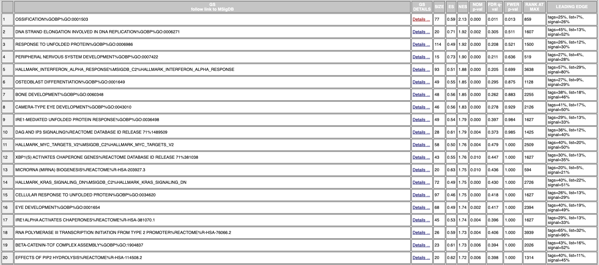

Some results from the positive top term are:

* **Name**: 	OSSIFICATION%GOBP%GO:0001503

* **P-value**: 0.000

* **ES**: 0.59

* **NES**: 0.213

* **FDR**: 0.011

* **Number of Genes in Leading Edge**: 19

* **Top Gene Associated with this Gene Set**: EXT1

*Downregulated Results*:
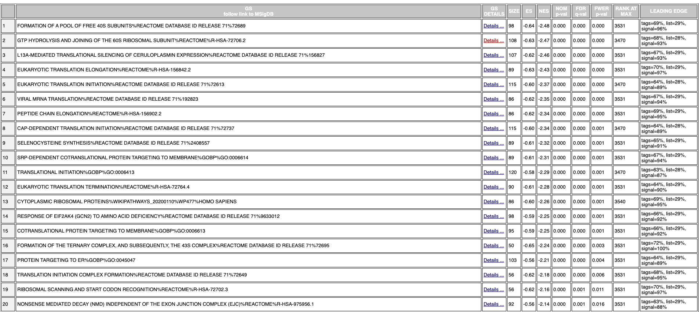

Some results from the negative top term are:

* **Name**: FORMATION OF A POOL OF FREE 40S SUBUNITS%REACTOME DATABASE ID RELEASE 71%72689

* **P-value**: 0.000

* **ES**: -0.64

* **NES**: -2.48

* **FDR**: 0.000

### Comparison of Thresholded vs Non-Thresholded Results

**Positive / Upregulated Results**

A straightforward comparsion and commonality could be made between the REACTOME results of the thresholded method and the non-thresholded method. The common theme illustrated in both method's results were building of necessary bodily materials. In the REACTOME results, common term names invovled transport of mature mRNA and SUMOylation. Both of these things are involved in the process of creating more DNA and proteins for the body. Transporting mRNA can lead to proteins being created, and SUMOylation is an aspect of post-translational modifications of proteins. Both of these aspects are important for creating finalized products of proteins. From the non-thresholded method, common results involved aspects of bone development and DNA development. The aspects of bone development that were results from the non-thresholded method were ossification, osteoblast differentiation and bone development. The various forms of DNA development that were results from the non-thresholded method were peripheral nervous system development, miRNA biogenesis and eye development. All of the different forms of development and growth as results from the thresholded and non-thresholded methods illustrate an upregulation in creation and building of various necessary bodily features. Though on different scales (REACTOME was more micro and the non-thresholded method involved more overall organs / systems) both methods involved upregulation of various materials needed to create and sustain bodily materials.

The GO threhsolded results for the upregulated results seemed to contradict the non-thresholded results, as the GO thresholded results focused on catabolic processes, which is when something is breaking down. This is the opposite of the non-thresholded results, who focused on building things instead of destroying them. Therefore the GO thresholded results did not have a straightforward similarity with the non-thresholded upregulated results but instead a straightforward discrepancy.

**Negative / Downregulated Results**

At first when I compared the results of the thresholded and non-thresholded experiments, nothing really jumped out at me. But once I took a step back and looked at the overall themes that could be seen from both experiments, it seemed that there actually was a straightforward commonality. In the thresholded results, an overall theme that appeared was inflammation and infection. This was evident from the term names neutrophil degranulation, leukocyte degranulation and other names of cells activated during an immune response. As these were all aspects that took part in inflammation and infection and were downregulated, it lead me to believe that inflammation and infection were generally downregulated in the patients after they had bariatic surgery. This aligns with results from the non-thresholded method, like the results of downregulation of viral mRNA translation and silencing of ceruloplasmin expression. Downregulation of viral mRNA translation indicates to me that there is less viruses occurring in the patients and therefore less of a possibility and necessity for inflammation and infection to occur. In addition, I researched what would be a reason for too much ceruloplasmin expression (which is the opposite of our results). The results from this research were that too much ceruloplasmin indicated that a serious infection was occuring in the body. As ceruloplasmin expression was downregulated, then it is likely that there was less occurrences of serious infections. This is the same overarching theme as the thresholded experiment. Therefore, infection and inflammation (resulting from infection) were able to be seen and compared to be downregulated in both the thresholded and non-thresholded results.


# Enrichment Map

Now that I have my GSEA results, I can use these to create an enrichment map on Cytoscape[@Shannon:2003:Genome-Res:14597658].


### How to Create an Enrichment Map

* Apps > Enrichment Map

* Click on the file folder and import the results from the GSEA method

* Check the box next to "Show Advanced Options" to be able to select the p-value cutoff and the FDR q-value cutoff

* Click the "Build" button

## Generating an Enrichment Map 

I first tried to create an enrichment map using the parameters of a p-value of 0.05 and an FDR value of 0.05. However, whenever I did this it only displayed mostly downregulated results (as demonstrated in blue):

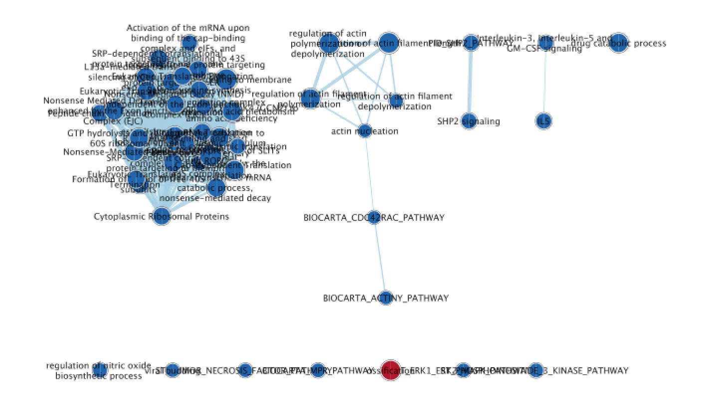

So I decided to edit my parameters slightly so I would have more results for upregulated genes. To be able to have this occur, I adjusted my parameters to have a FDR value of 0.25 and the same p-value as before of 0.05. When I did this, I was able to have more results for both upregulation (red) and downregulation (blue):

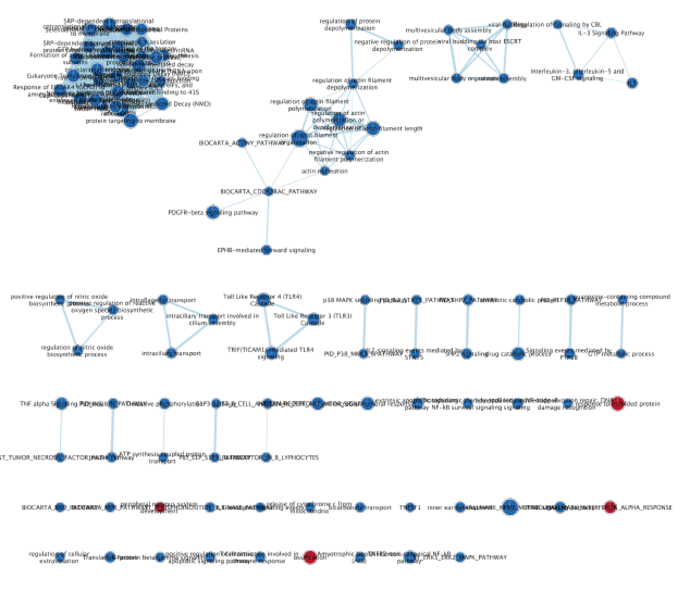

## Details About the Network

In the final network that I created, I clicked on the "show advanced options" to be able to select the p-value of 0.05 and the FDR value of 0.25.

In this network, there are 112 nodes and 516 edges.

## Annotating the Network

### How to Annotate the Network

* Apps > AutoAnnotate > New Annotations Set

* On the Quick Start page, I left the "Annotate entire network" selected

* On the Advanced page, I selected the button "Create singleton clusters" (since I had lots of clusters with a single gene inside)

* Select "create annotation"

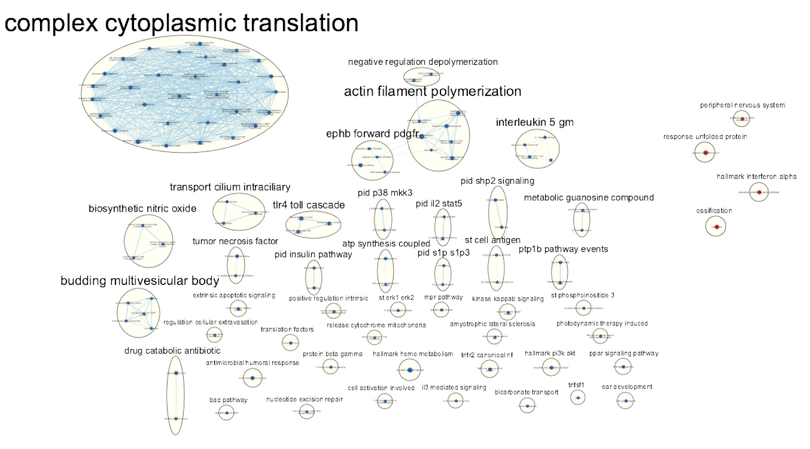

## Publication Ready Figure

I used the resulting network from the previous steps to create my publication ready figure, by adding a figure legend:

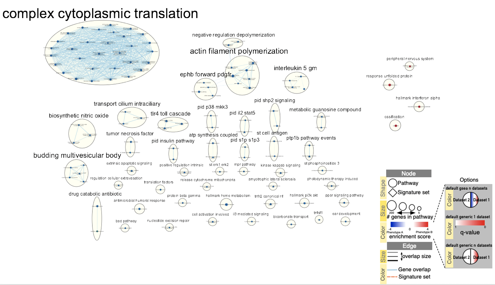

## Theme Network

The various themes can be analyzed by looking at the bolded words that surround various groups of genes (ex: complex cytoplasmic translation)


As there are lots of singleton clusters in my network, there are lots of different themes present in my analysis. These themes being shown are very similar to my results from the thresholded and non-thresholded methods. Themes like ossification, ear development, peripheral nervous system development are upregulated in the network, and are seen as upregulated in the non-thresholded method results. Themes like heme metabolism and antimicrobial humoral response are downregulated in the network and align with the thresholded and non-thresholded theme results as well. 

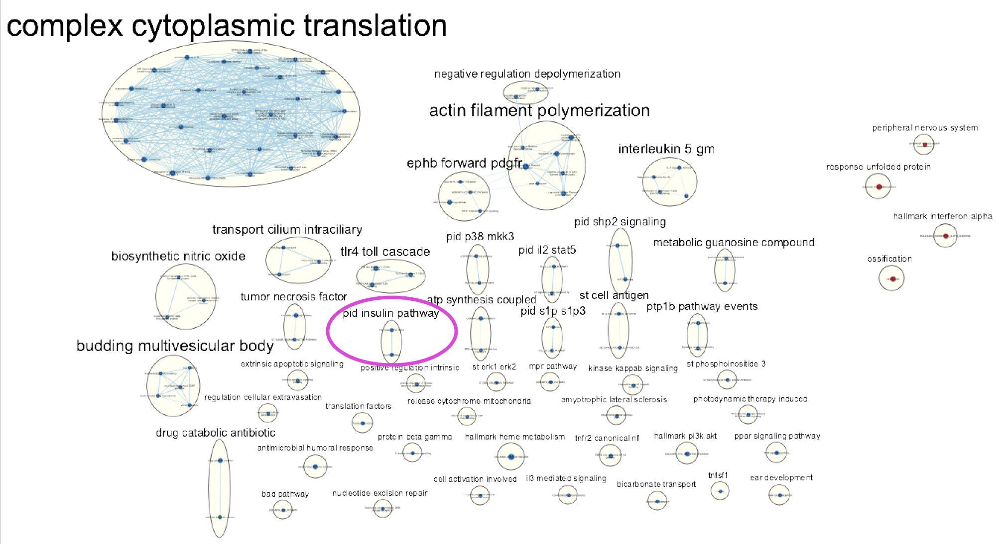

Another theme that was seen in the network (but not really pointed out in the thresholded and non-thresholded methods) was pid insulin pathway. This theme was downregulated, which makes logical sense to me as the paper analyzed patients before and after bariatic surgery. The overall purpose of bariatic surgery is to lose weight by making the patients stomachs smaller, making the patients eat and drink less. If you are eating less, then you require less insulin. Insulin is a hormone that aids in signalling for the food eaten to be transformed into energy and storage. Since there is less food being eaten, then there is less food that can be transformed into energy and storage, and therefore a lower requirement of insulin.

# Pathway Investigation: Folate Metabolism

### How to create the Pathway

* File > Import > Network from Public Databases...

* In "Data Source" select WikiPathways

* Search WIP179 (WikiPathway code for folate metabolism)

* Click on the folalte metabolism column

* Click on "Import as Network"

Now, to be able to see the colour gradient (blue, white, red) based on the rank of genes in this pathway:

* File > Import > Table from File

* Select the .rnk file from earlier

* In the control panel, move to Style

* Select Fill Colour, and then select the name of your .rnk file

### Results of Creating the Folate Metabolism Pathway

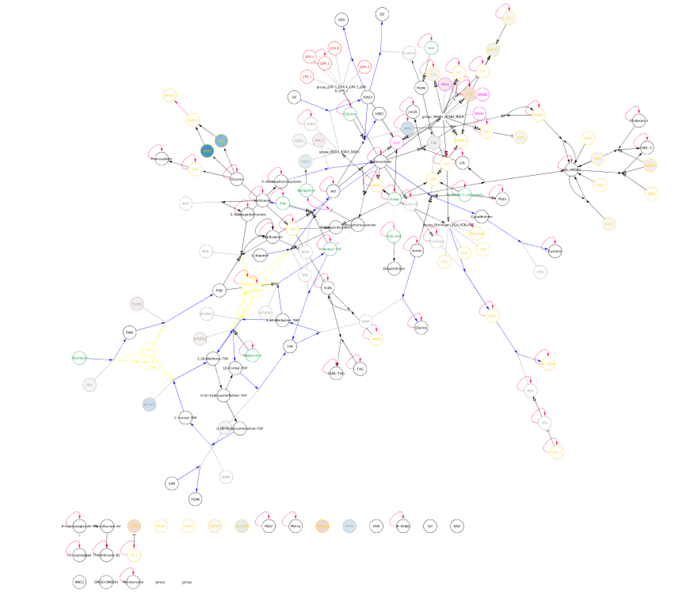

## Information about the Pathway

I chose this downregulated pathway as it matched with some of the large themes that were downregulated in the network. Folate metabolism relates to metabolism, oxidation and inflammation. Inflammation is shown as a downregulated theme in the non-thresholded method used as well as it relates to the theme of infection illustrated in the thresholded downregulated results. Furthermore, insulin (which relates to metabolism) was shown to be a downregulated theme in the network as well which was not as clearly shown in the thresholded / non-thresholded methods, so it would be interesting to use a pathway that incorporates that as well.

## Annotating the Pathway

I imported my rank file into the folate metabolism pathway to be able to see how the different genes in the pathway had been affected in the patients after the bariatric surgery. There were various downregulated (blue) and upregulated (red) genes shown in the pathway. I found information about as many of the downregulated and upregulated genes in the pathway as I could, and it seems that the results of the upregulaltion and downreulgation of these genes match with the results found from other methods I have performed (thresholded and non-thresholded methods)!

## Downregulated Genes
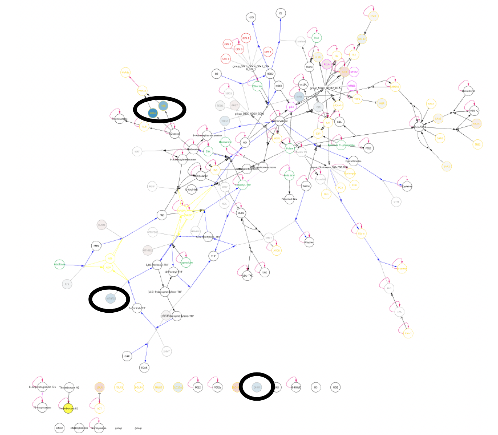
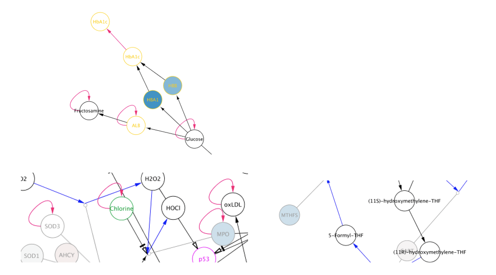

The most obviously downregulated (darkest blue node) gene seen in the pathway was HBA1. When looking at the pathway, it can be noticed that HBA1 originates from glucose. Glucose comes from the breakdown of food, which occurs when the hormone insulin is released. It was stated earlier in the enrichment map results that the pid insulin pathway was downregulated; meaning less insulin was being released, and therefore less glucose was being made. If less glucose is made, then less HBA1 would be produced as HBA1 is produced from glucose. Therefore the downregulation of HBA1 aligns with our previous enrichment map results.

HBB is another downregulated gene that can be seen in the pathway. It is located in an almost identical position pathway-wise to that of HBA1, (in which it originates from glucose), and therefore also makes logical sense to be downregulated just as HBA1 is.

MTHFS[@MTHFSgene] was seen to be a lighter shade of blue, nonetheless showing to be downregulated. After some research, MTHFS is a gene that supplies carbon for the biosynthesis of purines, thymine and amino acids. Carbons originate from glucose. As previously mentioned, glucose is downregulated due to the lack of food entering the patient's body after the surgery since less insulin is being used for signalling, so less food is taken in to be broken down and used. Therefore with the lack of insulin comes the lack of glucose, and there will therefore be a deficit in carbon molecules. If there is a deficit of carbon molecules, the MTHFS gene has a lower ability to perform its task of supplying carbon to make amino acids and other biological products. Therefore the downregulation of MTHFS aligns with the results of the downregulation of the pid insulin pathway from the enrichment map.

The gene MPO[@MPOgene] was downregulated as well. MPO is a gene that is most abundantly expressed in neutrophil granulocytes and functions to produce hypohalous acids which carry out antimicrobial activity. This means that MPO is a gene that is involved with immune response to infections or other illnesses. The downregulation of MPO aligns with the results of downregulation of inflammation and infection as seen from the thresholded and non-thresholded methods. If MPO is downregulated, then there is less hypohalous acids which means there is less antimicrobial activity. The lack of antimicrobial activity leads me to believe that there is no need for it, meaning that there is less infections and less inflammation, as seen by the thresholded and non-thresholded results.

## Upregulated Genes
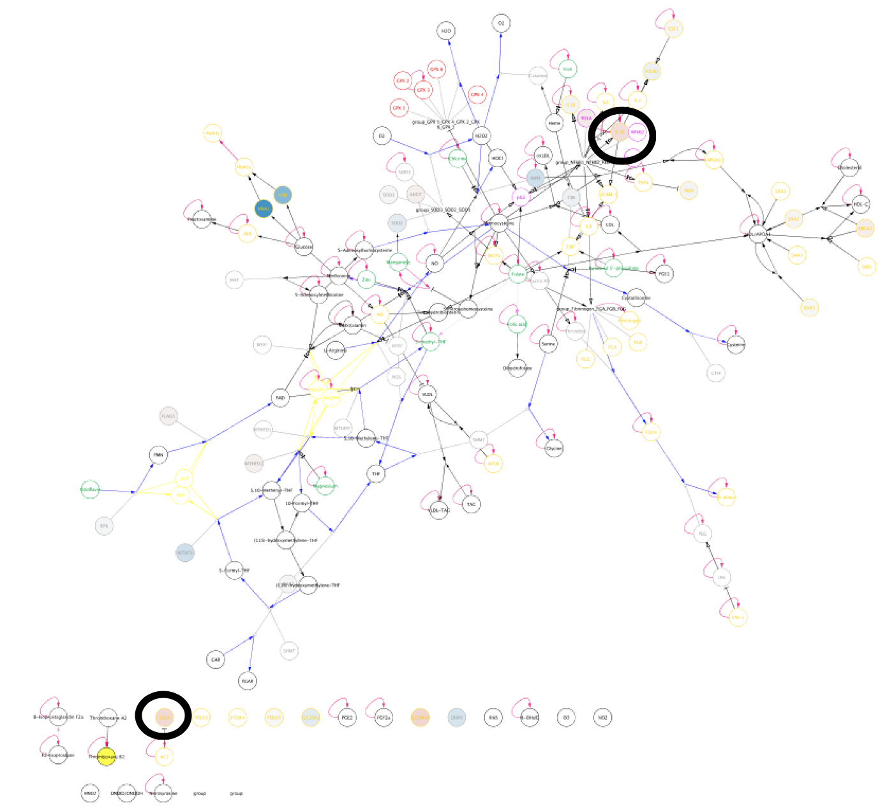
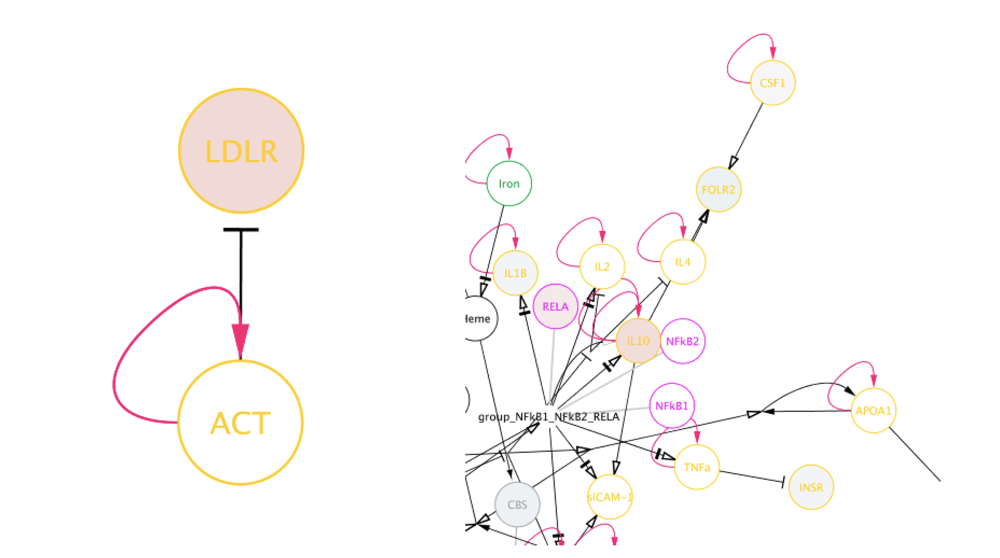

Though this pathway was shown to be downregulated, there were some upregulated genes shown in it. This suprised me at first, however after some research it became more clear to me how the upregulation of those genes allowed the overall pathway to be downregulated and align with previous results.

IL10[@IL10gene] was one of the genes that were upregulated. IL10 is a gene that functions to downregulate the expression of substances secreted from cells of the immune system. Therefore, if IL10 is upregulated, then more secreted substances of immune system cells are downregulated. Our previous results indicated that the immune result was downregulated, which is exactly what the upregulation of IL10 is doing! Therefore, the upregulation of IL10 matches our previous results.

LDLR[@LDLRgene] is another upregulated gene. LDLR stands for low-density lipoprotein receptor. It functions to collect low-density lipoproteins (LDL) from the bloodstream and break them down into cholesterol to either be used or excreted from the body. LDL is a very harmful form of lipoprotein, and is usually referred to as the "bad" cholesterol as a high quantity of LDL can lead to an unwanted buildup of cholesterol in the arteries. Therefore, the upregulation of LDLR allows your body to be more "healthy", as it is breaking down and reducing the amount of LDL in your body. Therefore, the more low-density lipoprotein RECEPTORS in your body, the less low-density lipoprotein in your body! In my opinion, though this finding does not exactly align with any of the previous results found, it does align with the overarching analysis and point of the paper. The point of the paper was to analyze patients before and after bariatric surgery. Bariatric surgery is used in an attempt to make people healthier and less overweight. Having less LDL in your body makes you healthier, which aligns with the overall results of the paper and the purpose of the surgery to be performed.


# Interpretation

## Enrichment Map Results vs Paper's Results

As explained in various earlier sections, there are lots of commonalities between the results of the thresholded method as well as the non-thresholded method. As the thresholded results were already described (in A2) to be very similar to that of the paper, the same is the case for the non-thresholded method! Downregulated trends explained in the paper involved metabolic functions of adipose tissue; more specifically, immune responses of adipose tissue, antiviral factor and neutrophil-mediated inflammation. Downregulation in inflammation can be seen very explicitly in the results and analysis of the folate metabolism pathway. In addition, the downregulation of antiviral factor is very similar to the downregulation of antimicrobial humoral response, as they are both used to prevent harmful organisms or viruses from entering and harming the body. The downregulation of both also align with the results of decreased inflammation, since decreased need for protection against harmful substances would mean that there are less harmful substances in the body and therefore the body requires less of an inflammatory response.

Also addressed in the paper was after the bariatric surgery, there was a decrease in the patients having insulin resistance; meaning their body was able to still detect when insulin was being secreted and would respond to that hormone. This is commonly due to the body not releasing as much insulin. This aligns directly with the theme of downregulation of the pid insulin pathway; meaning there was less insulin being secreted, meaning less of a chance of patients developing insulin resistance (if insulin is not there, how would one develop resistance to it?).

## Publications to Support the Enrichment Map Results

As the downregulation of inflammation and neutrophil production from the non-thresholded method were similar to the thresholded method, these results also align with the [paper](https://journals.sagepub.com/doi/full/10.1177/1457496913490467)[@santos2014effect] previously discussed (in A2). In this paper, it was explained that neutrophil production was decreased in patients after the bariatric surgery. This was identical to the results in the non-thresholded method, where neutrophil products were also decreased (explained in more detail in the folate metabolism pathway analysis). In addition, this paper mentioned that there was decreased quantities of triglycerides. This is similar to the non-thresholded results, as the pid insulin pathway was also downregulated. If the insulin pathway was reduced, then there is less of a hormone signal indicating that food taken in needs to be used or stored; meaning less food was convered into triglycerides. Therefore a downregulation of insulin equates to a downregulation of triglycerides. Therefore, the paper my data is based off of as well as this other paper provide similar results. 

Another [paper](https://www.nature.com/articles/tpj201243/)[@graessler2013metagenomic] found similar downregulation results as my non-thresholded method results. Again, the paper indicated downregulation in inflammatory activity, as well as a downregulation in glucose activity (they described it as glucose stabilization in the patients - which looking more into the paper meant that the amount of glucose and its activity decreased). Inflammation and glucose activity were also decreased in my results, as earlier explained by the downregulation in antimicrobial humoral response, the downregulation of the folate metabolism pathway, and the downregulation of the pid insulin pathway.

# References


